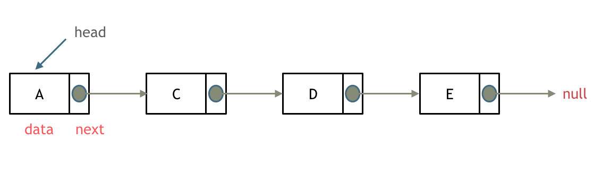

# LinkedList

[Back to Catalogue](https://github.com/TerryTxx/CS-Diary/blob/master/Algorithm/self_study.md)

### Removing elements from a linked table


### Removing elements from a linked table

(Leetcode 203)
1. Routine to determine node position and then delete
- 1. If you remove the regular intermediate node，where the previous node skips the node to be deleted and points directly to the next node;
- 2. If you are removing the head node, you can point head to head. next and the removal will be completed; 
- 3. In the case of a trailing node, directly null the previous node of the trailing node.
```java
// delete in the orgin linkedList
    if(head != null && head.val != val){//if null, no need to delete
        head = head.next;
        
        cur = head; // to find the head before curr, the pointer
                    // curr point curr.next.next
        while(cur != null && cur.next != null){//loop to find
            if(cur.next.val == target){
                cur.next = cur.next.next;//find target and its prev point to its next and skip it
            }else{
               cur = cur.next // not find , point to the next
             }   
        }return head;
    }
```
```java
// add a new dummy head node
public ListNode removeElements(ListNode head, int val) {
    if (head == null) {
        return head;
    }
    // because maybe to delete the head, so we add a dummy before head
    ListNode dummy = new ListNode(-1, head);
    ListNode pre = dummy;
    ListNode cur = head;
    while (cur != null) {
        if (cur.val == val) {
            pre.next = cur.next;
        } else {
            pre = cur;
        }
        cur = cur.next;
    }
    return dummy.next;
}
```


2. You can create a virtual head node, dummyHead, and then delete any element, which can follow uniform rules and does not require prior judgement
```java
public ListNode removeElements(ListNode head, int val) {
    if (head == null) {
        return head;
    }
    ListNode dummy = new ListNode(-1, head);
    ListNode pre = dummy;
    ListNode cur = head;
    while (cur != null) {
        if (cur.val == val) {
            pre.next = cur.next;
        } else {
            pre = cur;
        }
        cur = cur.next;
    }
    return dummy.next;
}
```


