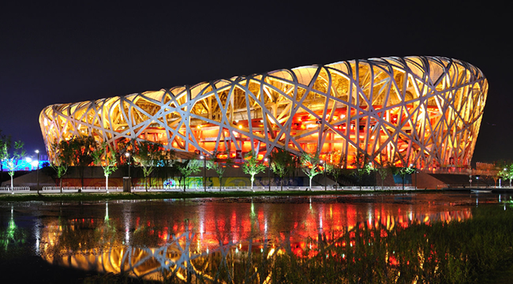

# Animation by JS and CSS

### [Back to Root Catalogue](https://github.com/TerryTxx/CS-Diary/blob/master/WebNote/html:css:js.md)

### used quited often
```text
1. The CSS transition over property allows for simple animations.
   JS can use this property to easily animate elements (a bonus question for food pyramids).
   
   we generally combine, rather than use, the timers created in the previous chapter.
   
2. Function Throttling（delayer）
    After a function has been executed once, a second execution is only allowed after a period greater than the set period；
```
```js
    var lock = true;
    function//to be throttling()
    {
        // if the lock if false(locked), no go through
        if (!lock) return;
        //here is funcion body of the function
        lock = false;//close the lock
        //2 secs later open the lock
        setTimeout(function () {
            lock = true;
        }, 2000);
    }
```

## Exercise

#### [pic sources](https://github.com/TerryTxx/CS-Diary/blob/master/WebNote/pics/JS+CSS)
### [Animation01： Seamless continuous rolling](#animation01)
### [Animation02： Carousel](#animation02)
### [Animation03：Breath Rotation](#animation03)


```
Demo1: we made a box, press move to control it from left to right, and press move again make it moving from right to left.

???What should we do if we want to press move again after the box has reached the bottom in order to return? See part 2, Function throttling.
```
```html
<!DOCTYPE html>
<html lang="en">
<head>
    <meta charset="UTF-8">
    <title>Title</title>
    <style>
        #box{
            position: absolute;
            top: 100px;
            left: 100px;
            width: 100px;
            height: 100px;
            background-color: orange;
        }
    </style>
</head>
<body>
    <div id="box"></div>
    <button id="btn1">Move</button>
    <script>
        //get element
        var oBox = document.getElementById('box');
        var oBtn1 = document.getElementById('btn1');
        //Set a marker value to confirm the current position of the box.
        var pos =1; //1 left, 2 right
        // add listener
        oBtn1.onclick = function (){
         //and transition
            oBox.style.transition = 'all 2s linear 0s';
            if(pos ==1 ) {
                oBox.style.left = '1100px';
                pos = 2;
            }else if(pos ==2 ){
                oBox.style.left = '100px';
                pos =1;
            }
        };
        </script>
</body>
</html>
```
###### [[back to list]](#exercise)
Demon 2:
to better the animation above
```html
<!DOCTYPE html>
<html lang="en">
<head>
    <meta charset="UTF-8">
    <title>Title</title>
    <style>
        #box{
            position: absolute;
            top: 100px;
            left: 100px;
            width: 100px;
            height: 100px;
            background-color: orange;
        }
    </style>
</head>
<body>
    <div id="box"></div>
    <button id="btn1">Start</button>
    <script>
        //get element
        var oBox = document.getElementById('box');
        var oBtn1 = document.getElementById('btn1');
        var lock =true;
        //Set a marker value to confirm the current position of the box.
        var pos =1; //1 left, 2 right
        // add listener
        oBtn1.onclick = function (){
            if(!lock) return;
         //and transition
            oBox.style.transition = 'all 2s linear 0s';
            if(pos ==1 ) {
                oBox.style.left = '1100px';
                pos = 2;
            }else if(pos ==2 ){
                oBox.style.left = '100px';
                pos =1;
            }
            lock = false;
            setTimeout(function () {
                lock = true;
            }, 2000);
        };
        </script>
</body>
</html>
```
###### [[back to list]](#exercise)
#### Animation01
###### Seamless continuous rolling
###### Wrapping animation as a function
```js
<!DOCTYPE html>
<html lang="en">
<head>
    <meta charset="UTF-8">
    <title>Title</title>
    <style>
        *{
            margin: 0;
            padding: 0;
        }
        .box{
            width: 1000px;
            height: 130px;
            border: 1px solid #000;
            margin: 50px auto;
        /* 2.   overflow:hidden; to make the list shorter ,add and show later than 3. timer*/
        /* 6. add the code above*/
            overflow:hidden;
        }
        .box ul{
            list-style: none;
            width: 5000px;
            position: relative;
        }
        .box ul li{
            float: left;
            margin-right: 10px;
        }
    </style>
</head>
<body>
    <div id="box" class="box">
        <ul id="list">
            <li></li>
            <li></li>
            <li></li>
            <li></li>
            <li></li>
            <li></li>
        </ul>
    </div>

    <script>
    var box = document.getElementById('box');
    var list = document.getElementById('list');
        
   // 1. dupilcate list once more to make it longger
        list.innerHTML += list.innerHTML;
        
    // 3. use a local value, show the list's left, so the list position is relative
    var left = 0;
        
    // // 7. we use a timer as local value to record the moving
    //     var timer =setInterval(function (){
    // //5. total length of the list 210px(each pic.length+ 10px margin)*6=1260px, run
    //     if(left <= -1260){ left = 0}
    //     left -= 4;
    // //4. we use a timer to make the list run from left, but the tail will be missing
    //     list.style.left = left + 'px';
    //     },20);

    //9. add an function as listener to restart the time, and seperate the 4,5,7
    var timer;
    move();
    //10 .Wrapping animation as a function
    function move(){
        //!!!!!! 11. when you use a list <li> you should close it in first,overloading the animation (incase DOM0/2 problem, fasting the slide)
            clearInterval(timer);
           timer = setInterval(function (){
               left -= 4;
               if(left <= -1260){
                   left = 0
               }
               list.style.left = left + 'px';
           },20)
        }
    // 8. add onmouseenter to listener/stop the timer
    box.onmouseenter = function (){
        clearInterval(timer);
    };

    box.onmouseleave = function (){
         move();
    };
  </script>
</body>
</html>
```
###### [[back to list]](#exercise)
#### Animation02
###### Carousel
```js
<!DOCTYPE html>
<html lang="en">
<head>
    <meta charset="UTF-8">
    <title>Title</title>
    <style>
        *{
            margin: 0;
            padding: 0;
        }
        .carousel{
            width: 650px;
            height: 360px;
            border: 1px solid #000;
            margin: 50px auto;
            position: relative;
        /*9. confirm all the animation is OK ,add box to limit the pic space*/
            overflow: hidden;
        }
        .carousel ul{
            list-style: none;
            width: 6000px;
            position: relative;
            left: 0px;
            /*3. add transition*/
            transition: left 1s ease 0s;
        }
        .carousel ul li{
            float: left;
        }
        .carousel .leftbtn{
            position: absolute;
            left: 20px;
            top: 50%;
            margin-top: -25px;
            width: 50px;
            height: 50px;
            background-color: grey;
            border-radius: 50%;
        }
        .carousel .rightbtn{
            position: absolute;
            right: 20px;
            top: 50%;
            margin-top: -25px;
            width: 50px;
            height: 50px;
            background-color: grey;
            border-radius: 50%;
        }
    </style>
</head>
<body>
    <div id="box" class="carousel">
        <ul id="list">
            <li></li>
            <li></li>
            <li></li>
            <li></li>
            <li></li>
        </ul>
<!--2. add here-->
        <a href="javascript:;" class="leftbtn" id="leftbtn"></a>
        <a href="javascript:;" class="rightbtn" id="rightbtn"></a>
    </div>

    <script>

    //get ul, and btn
    var leftbtn = document.getElementById('leftbtn');
    var rightbtn = document.getElementById('rightbtn');
    var list = document.getElementById('list');
    //5. by Animation01 we know colone the first pic so roate the slide, or it will very strange, you can check to stop in step4
    var cloneli = list.firstElementChild.cloneNode(true);//5
    list.appendChild(cloneli);//5

    //local value of IL
    // 4. at step 3, we could will have empty at the end, so we change the left value to use index
    // var left = 0; //deleted by step 4
    var idx = 0; //added by setp4

    //11. add lock to perfect your code, as if the customer press too fast
    var lock =true;

    //listener
    rightbtn.onclick = function (){
        if(!lock) return;
        lock = false;

        //8. because step7, we need re-add the transition
        list.style.transition = 'left 1s ease 0s';

        // left -= 650;//deleted by step4
        idx ++ ; //added by setp4
        if(idx >4){
            //6. add delayer, back to index0 asap
            setTimeout(function () {
                //7. remember to cancel the transition in first, not roll back to first idx
                list.style.transition = 'none';
                list.style.left = 0;
                idx = 0;
            },500);
        }
        // list.style.left = left + 'px';//deleted by step4
        list.style.left = -idx*650 + 'px';//added by setp4
        //1. by now works but href will refresh the webpage, add javascript:; in href="", step2

        // reopen the lock
        setTimeout(function () {
            lock = true;
        },500);
    }

    //10. we can add the left button again as above:
    leftbtn.onclick = function (){
        if(!lock) return;
        lock = false;
        if (idx == 0){
            list.style.transition = 'none';
            list.style.left = -5 * 650 + 'px';
            // add a delayer 0ms, to stop the rolling back
            setTimeout(function (){
                list.style.transition = 'left 1s ease 0s';
                idx = 4;
                list.style.left = -idx *650 +'px';
            },0);//this is quite more used in work
        }else{
            idx--;
            list.style.left = -idx *650 +'px';
        }
        setTimeout(function () {
            lock = true;
        },500);
    }
  </script>
</body>
</html>
```
###### [[back to list]](#exercise)
#### Animation03
###### Breath Rotation
```js
<!DOCTYPE html>
<html lang="en">
<head>
    <meta charset="UTF-8">
    <title>Title</title>
    <style>
        *{
            margin: 0;
            padding: 0;
        }
        .carousel{
            width: 650px;
            height: 360px;
            border: 1px solid #000;
            margin: 50px auto;
            position: relative;
        }
        .carousel ul{
            list-style: none;
        }
        .carousel ul li{
            position: absolute;
            top: 0;
            left: 0;
        /*    make all pic together and transparent, but first 1*/
        /*    the animation is change the opacity one by one*/
            opacity: 0;
            transition: opacity .8s ease 0s;
        }
        .carousel ul li:first-child{
            opacity: 1;
        }

        .carousel .leftbtn{
            position: absolute;
            left: 20px;
            top: 50%;
            margin-top: -25px;
            width: 50px;
            height: 50px;
            background-color: grey;
            border-radius: 50%;
        }
        .carousel .rightbtn{
            position: absolute;
            right: 20px;
            top: 50%;
            margin-top: -25px;
            width: 50px;
            height: 50px;
            background-color: grey;
            border-radius: 50%;
        }
    </style>
</head>
<body>
    <div id="box" class="carousel">
        <ul id="list">
            <li></li>
            <li></li>
            <li></li>
            <li></li>
            <li></li>
        </ul>

        <a href="javascript:;" class="leftbtn" id="leftbtn"></a>
        <a href="javascript:;" class="rightbtn" id="rightbtn"></a>
    </div>

    <script>
    //get ul, and btn
    var leftbtn = document.getElementById('leftbtn');
    var rightbtn = document.getElementById('rightbtn');
    var list = document.getElementById('list');
    var lis = document.getElementsByTagName('li')// an array
    // local value of current index
    var idx =0;

    //Throttling
    var lock = true;

    //right btn listener
    rightbtn.onclick =function (){
        //Throttling check
        if(!lock) return;
        lock = false
        // fade out the idx 0 pic
        lis[idx].style.opacity = 0;
        idx++;
        if(idx > 4) idx =0;
        // idx up, show the new pic
        lis[idx].style.opacity = 1;

        // reopen the lock, after the animation
        setTimeout(function (){
            lock = true;
        },1000)
    }

    //left is same of above
    leftbtn.onclick =function (){
        //Throttling check
        if(!lock) return;
        lock = false
        // fade out the idx 0 pic
        lis[idx].style.opacity = 0;
        idx--;
        if(idx <0) idx = 4;
        // idx up, show the new pic
        lis[idx].style.opacity =1;

        // reopen the lock, after the animation
        setTimeout(function (){
            lock = true;
        },1000)
    }

  </script>
</body>
</html>
```
###### [[back to exercise list]](#exercise)
###### [[TOP]](#used-quited-often)


---

Copyright notice:

Copyright © 2023, Tanxiaoxu
Unauthorized copying or usage of the contents of this article is prohibited.

